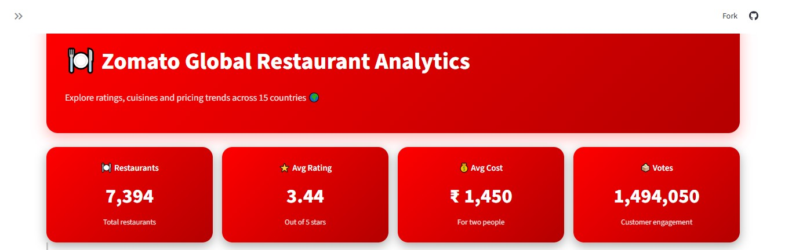
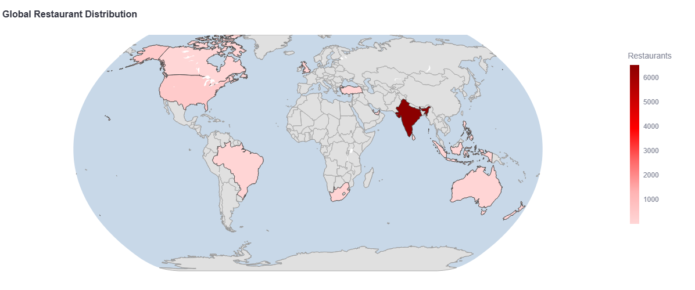
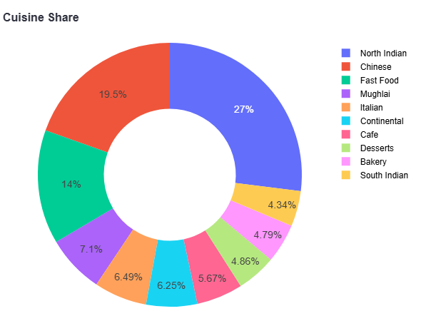
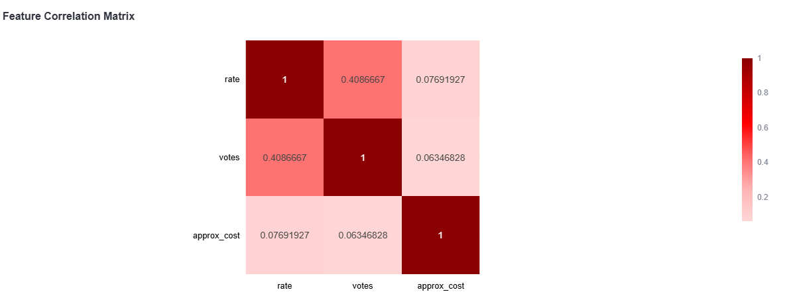

# Zomato Global Restaurant Analytics Dashboard

## Live App
[Click here to view the dashboard](https://zomato-dashboard-knufeafwukv3pbog2u2ktv.streamlit.app/)

## Problem Statement
Which countries and cuisines offer the best restaurant quality for the price?

## Screenshots

### KPI Overview

### Executive Summary

### World Map

### Delivery vs Dine-In

### Cuisine Share

### Correlation Matrix

## Key Findings
- 88% of restaurants are from India (6,513 out of 7,394)
- Cost strongly predicts rating — correlation of 0.88
- Dine-in restaurants rate higher than delivery (3.47 vs 3.38)
- Restaurants without table booking surprisingly rate higher (3.59 vs 3.41)
- UAE, Qatar and Singapore cluster at premium cost with consistently high ratings

## Tech Stack
Python | Pandas | Plotly | Streamlit

## Dataset
Zomato Restaurants Data from Kaggle — 7,394 restaurants across 15 countries